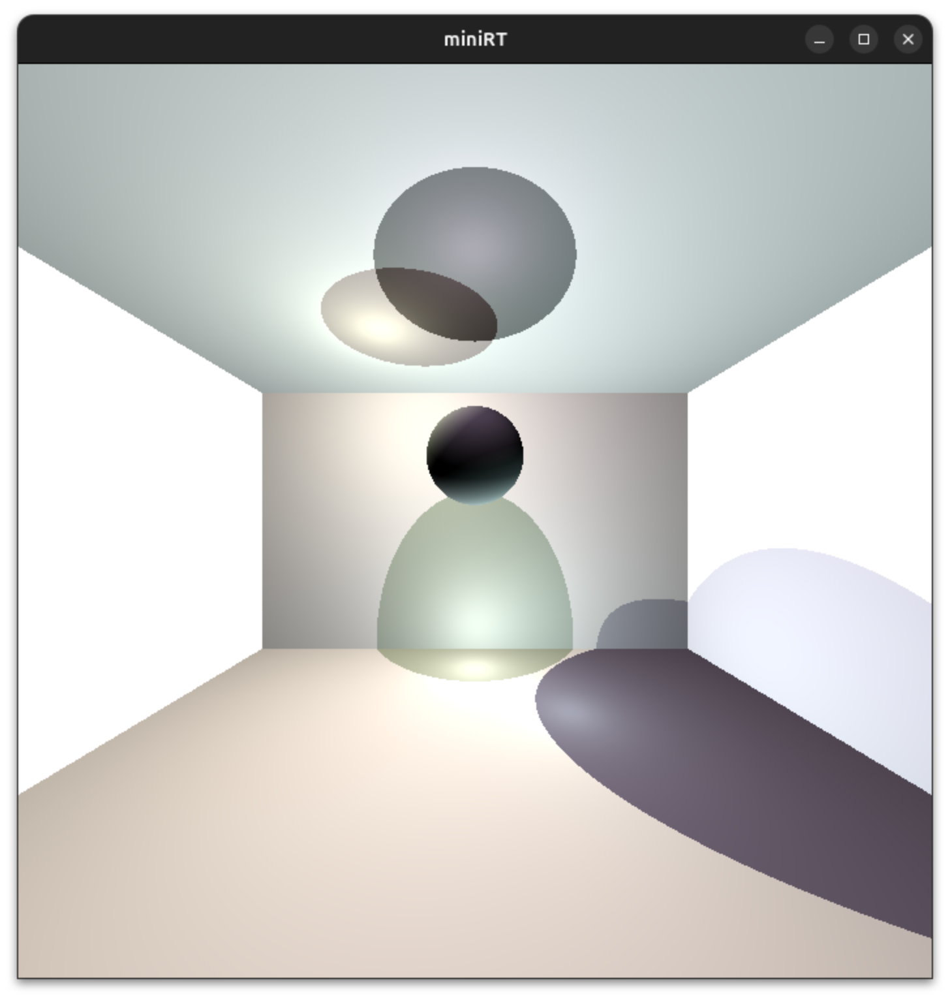
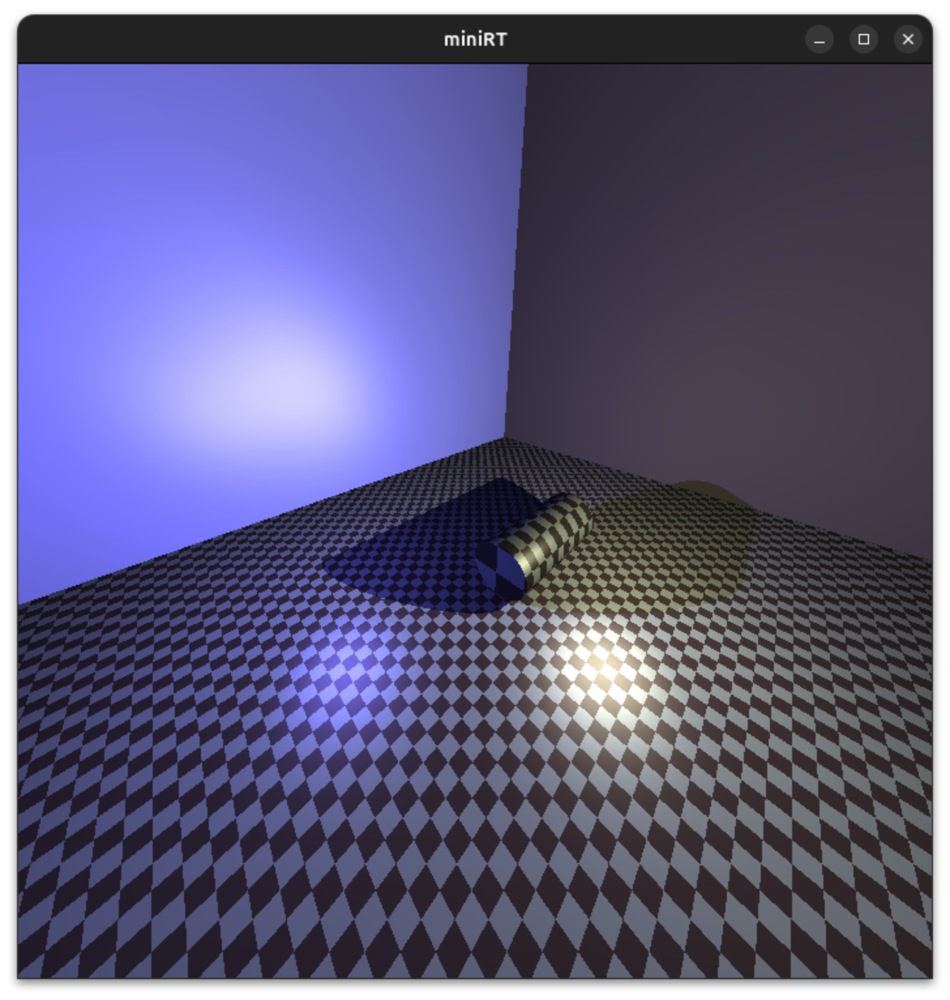

Great! Now let's update your README to showcase those rendered scenes. Here's the updated README with a Gallery section:

# miniRT

A ray tracer implementation in C using the MiniLibX graphics library. This project renders 3D scenes by tracing rays of light through a virtual camera, simulating realistic lighting, shadows, and geometric shapes.

## 📋 Table of Contents

- [Overview](#overview)
- [Gallery](#gallery)
- [Features](#features)
- [Technologies](#technologies)
- [Installation](#installation)
- [Usage](#usage)
- [Scene File Format](#scene-file-format)
- [Controls](#controls)
- [Examples](#examples)

## 🎯 Overview

miniRT is a comprehensive ray tracing engine that demonstrates fundamental computer graphics concepts. It parses scene description files and generates photorealistic images by simulating how light interacts with various geometric objects in 3D space.

The project implements the ray tracing algorithm from scratch, handling:
- Ray-object intersection calculations
- Surface normal computations
- Phong reflection model for realistic lighting
- Shadow casting with multiple light sources
- Camera transformations and perspective projection

## 🖼️ Gallery

### Featured Renders

<table>
  <tr>
    <td align="center">
      <br/>
      <sub><b>Complex Scene with Multiple Shapes</b></sub><br/>
      <sub>Demonstrates spheres, cylinders, and lighting</sub>
    </td>
    <td align="center">
      <br/>
      <sub><b>Interior Scene</b></sub><br/>
      <sub>Enclosed space with shadow casting</sub>
    </td>
    <td align="center">
      <br/>
      <sub><b>Material Patterns</b></sub><br/>
      <sub>Checkerboard textures on multiple objects</sub>
    </td>
  </tr>
</table>

### Lighting Effects

<table>
  <tr>
    <td align="center">
      <br/>
      <sub><b>Specular Highlights</b></sub><br/>
      <sub>Phong reflection model demonstration</sub>
    </td>
    <td align="center">
      <br/>
      <sub><b>Shadow Rendering</b></sub><br/>
      <sub>Multiple light sources with hard shadows</sub>
    </td>
    <td align="center">
      <br/>
      <sub><b>Ambient + Diffuse Lighting</b></sub><br/>
      <sub>Soft ambient with directional diffuse</sub>
    </td>
  </tr>
</table>

### Geometric Shapes

<table>
  <tr>
    <td align="center">
      <br/>
      <sub><b>Spheres</b></sub>
    </td>
    <td align="center">
      <br/>
      <sub><b>Cylinders</b></sub>
    </td>
    <td align="center">
      <br/>
      <sub><b>Planes</b></sub>
    </td>
    <td align="center">
      <br/>
      <sub><b>Cones (Bonus)</b></sub>
    </td>
  </tr>
</table>

### Bonus Features

<table>
  <tr>
    <td align="center">
      <br/>
      <sub><b>Single Hyperboloid</b></sub><br/>
      <sub>Second-degree surface rendering</sub>
    </td>
    <td align="center">
      <br/>
      <sub><b>Hyperboloid Gallery</b></sub><br/>
      <sub>Multiple hyperboloids with varied parameters</sub>
    </td>
    <td align="center">
      <br/>
      <sub><b>Checkerboard Pattern</b></sub><br/>
      <sub>Procedural texture mapping</sub>
    </td>
  </tr>
</table>

*All images rendered at 700x700 resolution*

## ✨ Features

### Core Features
- **Multiple Geometric Primitives**
  - Spheres
  - Planes
  - Cylinders (with caps)
  - Cones (bonus)
  - Hyperboloids (bonus)

- **Advanced Lighting**
  - Ambient lighting with configurable intensity and color
  - Multiple point light sources with individual brightness and color
  - Diffuse shading based on surface orientation
  - Specular highlights (Phong reflection model)
  - Hard shadow rendering

- **Material Properties**
  - Customizable surface colors (RGB)
  - Adjustable specular reflection intensity
  - Checkerboard pattern textures (bonus)

- **Scene Configuration**
  - Flexible camera positioning and orientation
  - Field of view control (0-180 degrees)
  - Object transformations (translation, rotation, scaling)
  - Scene parsing from `.rt` files

## 🛠 Technologies

- **Language**: C (C99 standard)
- **Graphics Library**: MLX42 (MiniLibX)
- **Math Library**: libm (for trigonometric and vector operations)
- **Build System**: Make
- **Additional Libraries**:
  - Custom libft (standard C library reimplementation)
  - GLFW (for window management via MLX42)

### Key Algorithms & Techniques

- **Ray Tracing**: Core rendering algorithm with recursive ray casting
- **Matrix Mathematics**: 4x4 transformation matrices for object manipulation
- **Vector Operations**: Dot product, cross product, normalization
- **Quadratic Equation Solving**: For ray-sphere and ray-cylinder intersections
- **View Transformation**: Camera space to world space conversion
- **Color Blending**: Hadamard product for realistic color interaction

## 📦 Installation

### Prerequisites

- GCC or Clang compiler
- Make
- CMake (for building MLX42)
- GLFW development libraries
- Linux/macOS operating system

### Build Steps

```bash
# Clone the repository
git clone https://github.com/yourusername/miniRT.git
cd miniRT

# Build the project
make

# The executable 'miniRT' will be created in the root directory
```

## 🚀 Usage

```bash
./miniRT <scene_file.rt>
```

### Example

```bash
./miniRT test_files/spec1.rt
```

## 📝 Scene File Format

Scene files use the `.rt` extension and follow this syntax:

### Camera (Required, Once)
```
C x,y,z orientation_x,orientation_y,orientation_z fov
```
- Position: x,y,z coordinates of viewpoint
- Orientation: Normalized 3D vector (range: -1 to 1)
- FOV: Horizontal field of view in degrees (0-180)

### Ambient Lighting (Required, Once)
```
A brightness_ratio R,G,B
```
- Brightness: 0.0 to 1.0
- Color: RGB values (0-255)

### Point Light (Required, At Least One)
```
L x,y,z brightness R,G,B
l x,y,z brightness R,G,B  # Lowercase 'l' for additional lights
```
- Position: x,y,z coordinates
- Brightness: 0.0 to 1.0
- Color: RGB values (0-255)

### Sphere
```
sp x,y,z diameter R,G,B [specular [checker_c1 checker_c2]]
```
- Center: x,y,z coordinates
- Diameter: Sphere diameter
- Color: RGB values (0-255)
- Specular (optional): 0.0 to 1.0
- Checker colors (optional): Two RGB triplets

### Plane
```
pl x,y,z normal_x,normal_y,normal_z R,G,B [specular [checker_c1 checker_c2]]
```
- Point: Any point on the plane
- Normal: Normalized 3D vector
- Color: RGB values (0-255)

### Cylinder
```
cy x,y,z axis_x,axis_y,axis_z diameter height R,G,B [specular [checker_c1 checker_c2]]
```
- Center: x,y,z coordinates
- Axis: Normalized 3D vector
- Diameter & Height: Dimensions
- Color: RGB values (0-255)

### Cone (Bonus)
```
cn x,y,z axis_x,axis_y,axis_z diameter height R,G,B [specular [checker_c1 checker_c2]]
```

### Hyperboloid (Bonus)
```
hy x,y,z radius min,max R,G,B [specular [checker_c1 checker_c2]]
```

### Example Scene File
```
A 0.2 255,255,255

C 0,5,-30 0,0,1 100

L 10,10,10 0.8 255,255,255
l -10,10,10 0.5 200,200,255

sp 0,0,0 10 255,0,0 0.4
pl 0,-5,0 0,1,0 150,150,150 0.2
cy 5,0,5 0,1,0 3 10 0,255,0 0.6
```

## 🎮 Controls

- **ESC**: Exit the program

## 🖼 Examples

The `test_files/` directory contains various scene configurations:

- `spec1.rt` - Specular reflection demonstration
- `cone1.rt` - Cone geometry showcase
- `checkerboard1.rt` - Checkerboard pattern example
- `hyperboloid_showcase.rt` - Hyperboloid surface demonstration
- `inside_cube.rt` - Interior scene with multiple walls

## 🏗 Project Structure

```
miniRT/
├── src/
│   ├── canvas/          # Image buffer and pixel operations
│   ├── color/           # Color manipulation and patterns
│   ├── intersection/    # Ray-object intersection algorithms
│   ├── matrix/          # Matrix operations and transformations
│   ├── parsing/         # Scene file parser
│   ├── rendering/       # Ray tracing core and lighting
│   ├── shapes/          # Geometric primitive implementations
│   └── utils/           # Utility functions
├── libft/               # Custom C standard library
├── MLX42/               # Graphics library
├── test_files/          # Example scene files
├── renders/             # Rendered scene images
├── Makefile
└── minirt.h             # Main header file
```

## 🔧 Technical Details

### Rendering Pipeline
1. **Scene Parsing**: Read and validate `.rt` file
2. **Camera Setup**: Initialize view transformation matrix
3. **Ray Generation**: Create rays for each pixel through camera
4. **Intersection Testing**: Find closest object hit by each ray
5. **Lighting Calculation**: Compute color using Phong model
6. **Shadow Testing**: Cast shadow rays to light sources
7. **Image Output**: Write final pixel colors to canvas

### Mathematics
- 4x4 homogeneous transformation matrices
- Quadratic formula for sphere/cylinder intersections
- Vector dot/cross products for normals and reflections
- Phong shading: `color = ambient + diffuse + specular`

## 📚 Resources

- [The Ray Tracer Challenge](https://pragprog.com/titles/jbtracer/the-ray-tracer-challenge/) by Jamis Buck
- [Ray Tracing in One Weekend](https://raytracing.github.io/) by Peter Shirley
- [Scratchapixel - Ray Tracing](https://www.scratchapixel.com/lessons/3d-basic-rendering/introduction-to-ray-tracing)
- [42 School MiniLibX Documentation](https://github.com/42Paris/minilibx-linux)

## 👥 Authors

- Razan Srour (@rsrour)
- Tbaniatt (Contributor)

## 📄 License

This project is part of the 42 School curriculum.

---

**Note**: This project was developed as part of the 42 School curriculum and follows strict coding standards (The Norm). All memory allocations are properly managed, and the code is free from memory leaks.
